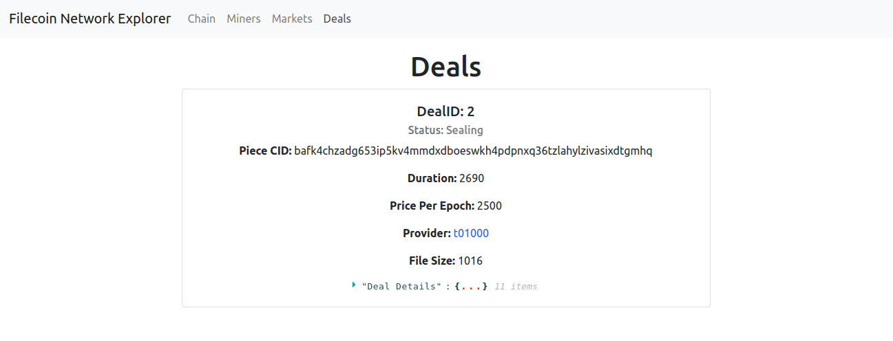
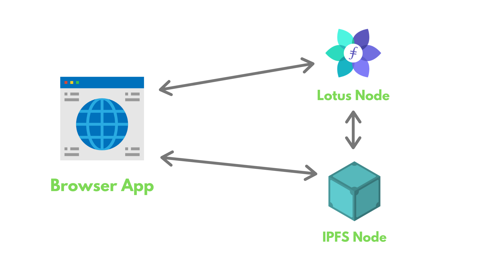

## Filecoin Network Inspector Sample Application

- [Overview](#overview)
- [App Architecture Overview](#app-architecture-overview)
- [How to run](#how-to-run)
- [License](#license)

### Overview

This tutorial shows how to build a Filecoin network inspector using lotus via a fork of Textile’s lotus-devnet, the Lotus JS API client, and go-ipfs.

The Filecoin network inspector interacts with several aspects of the Filecoin network that are exposed through Lotus’ JS API. The sample app in this tutorial will include:
- A simple chain explorer, showing information about Filecoin blocks.
- A miner explorer, showing information about all the active miners in the Filecoin network (in this example, this shows the miners in the local devnet).
- A marketplace, where you can add your files on the connected Filecoin network and see how storage and retrieval deals occur under the hood.
- A deals page, where you can see all your previous deals and their details.

**Chain**

**Miners**

**Market**

**Deals**

### App Architecture Overview

A high-level overview of our application architecture:
- Docker script to run a lotus node (Filecoin client) and local-devnet to mock interactions on a live network, like [testnet]() or [mainnet]().
- Active go-ipfs daemon (IPFS client) to generate data CIDs and import to store on Filecoin.
- React dashboard shows different features of the Filecoin network inspector. The dashboard uses various JavaScript libraries to interact with the lotus node and the go-ipfs node.

### How to run

Follow [this tutorial](https://docs.filecoin.io/build/examples/network-inspector/overview/) on Filecoin docs to get started.

### License

This is dual-licensed under Apache 2.0 and MIT terms:

- Apache License, Version 2.0, ([LICENSE-APACHE](./LICENSE-APACHE) or http://www.apache.org/licenses/LICENSE-2.0)
- MIT license ([LICENSE-MIT](./LICENSE-MIT) or http://opensource.org/licenses/MIT)
